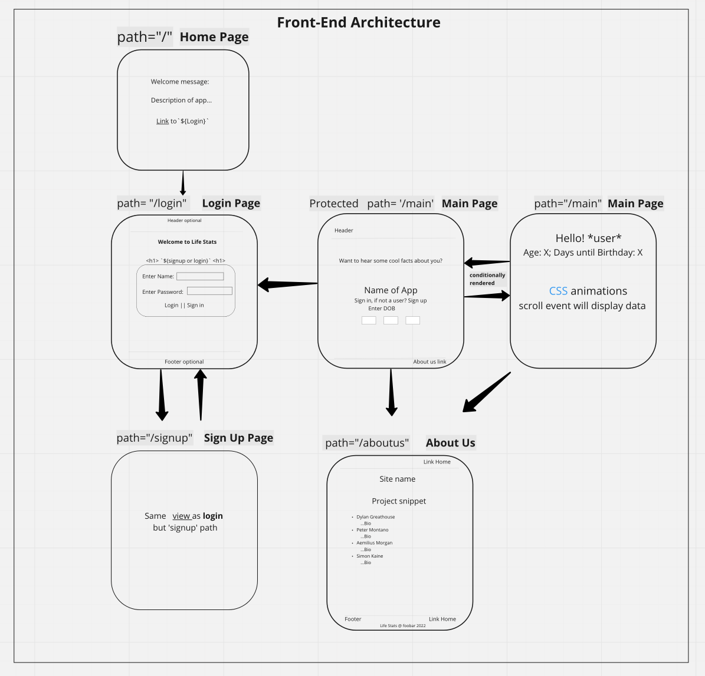
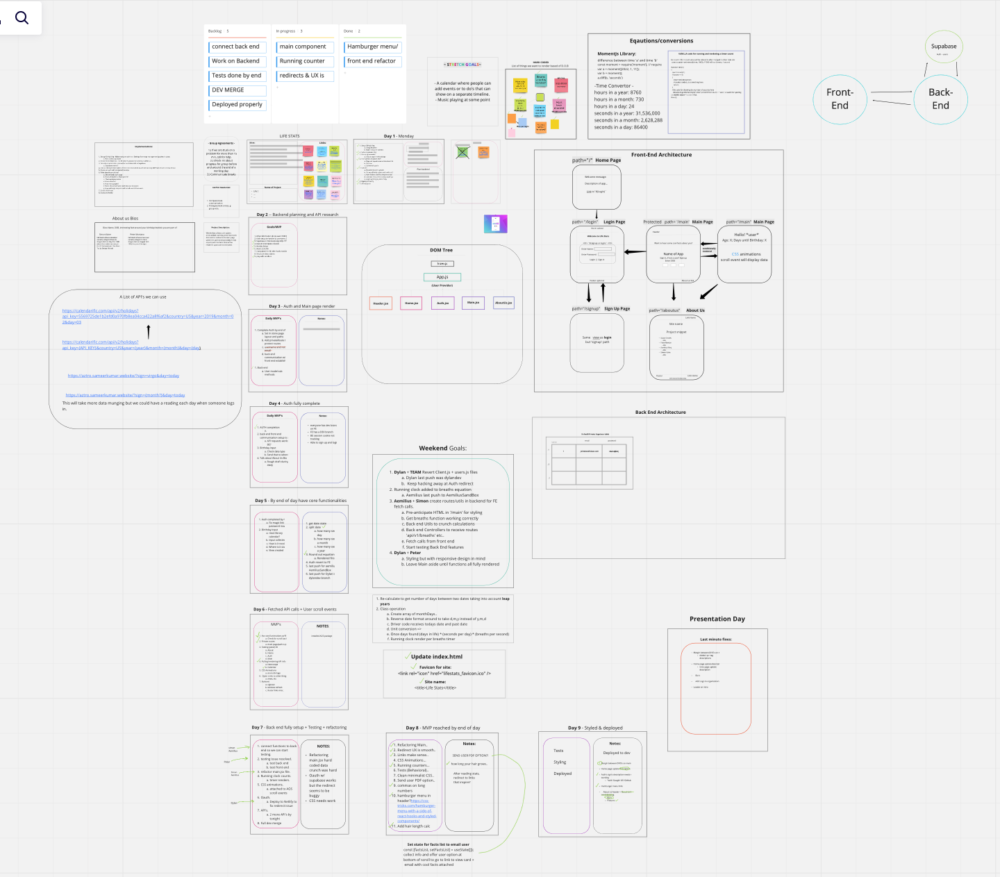

# LIFE STATS 
# https://pedantic-pasteur-453987.netlify.app

## DEV TEAM:
- Simon Kaine-- https://www.linkedin.com/in/simonbishopkaine/
- Aemilius Morgan-- https://www.linkedin.com/in/aemilius-morgan/
- Peter Montano-- https://www.linkedin.com/in/petermontano/
- Dylan Greathouse-- https://www.linkedin.com/in/dylan-greathouse/

# DESCRIPTION
 Life Stats turns your life into a fascinating sequence of facts and numbers. Enter in your birthday and enjoy the reflective and informational journey that awaits you! Now let's see what's happened since the day you were born; we've calculated breaths, blinks, heartbeats, years asleep, dream days, extinction estimates, holidays, hair growth and more! 

# TECH STACK 

| FRAMEWORKS | LIBRARIES             | LANGUAGES  | TESTING    | DATABASES  | TOOLS          |
|------------|-----------------------|------------|------------|------------|----------------|
| React.js   | React-router-dom      | JavaScript | Jest       | Supabase   | Node.js        |
| Express.js | Node-fetch            | CSS        | TDD        |            | Heroku         |
|            | AOS                   | HTML5      |            |            | Netlify        |
|            |                       |            |            |            | Miro           |
|            |                       |            |            |            | Slack          |
|            |                       |            |            |            | Thunder Client |
|            |                       |            |            |            | BeeKeeper      |
|            |                       |            |            |            | VS Code        |
|            |                       |            |            |            | GitHub         |

# REFERENCES
## icon images
-  <a href="https://freesvg.org/1539121879" target="_blank" alt="Black and white image of tree">Tree Icon Derived From An Image On Pixabay - www.freesvg.org</a>
-  <a href="https://www.pikpng.com/pngvi/bwxTTx_picture-black-and-white-stock-hands-svg-baby/" target="_blank" alt="Black and white image of hands holding feet">Picture Black And White Stock Hands Svg Baby - Footprint Clipart www.pikpng.com</a>
-  <a href="https://www.subpng.com/png-r41qsp/" target="_blank" alt="Silhouette of person flying in sunset sky">Planet Earth Transparent PNG - www.subpng.com</a>
-  <a href="https://favpng.com/png_view/holocene-animals-prehistoric-thylacine-ty-the-tasmanian-tiger-image-png/RT3vbNf9" target="_blank" alt="Cartoon drawing of Tasmanian Tiger">Holocene Animals Prehistoric - Thylacine Ty The Tasmanian Tiger Image PNG - www.favpng.com</a>
-  <a href="https://www.cleanpng.com/png-cousin-itt-wednesday-addams-gomez-addams-costume-p-1070705/" target="_blank" alt="Cousin It covered in long hair">Cousin It Character PNG - www.cleanpng.com</a>
-  <a href="https://www.pngall.com/sleep-png/download/27825" target="_blank" alt="Transparent image of person sleeping in bed">Sleep PNG Image HD - www.pngall.com</a>

## API
-- This API was used to take in three string queries based on user birthday entry data and returns a holiday matching query entry.
- https://calendarific.com/
- https://calendarific.com/api/v2/holidays?api_key=5569725de1b2efd0a970fb8ea04cca422a8f6af2&country=US&year=${year}&month=${mon}&day=${day}

# PLANNING 
## Miro Board
- Miro Board: https://miro.com/app/board/uXjVOXR1wUU=/?invite_link_id=36893782295

